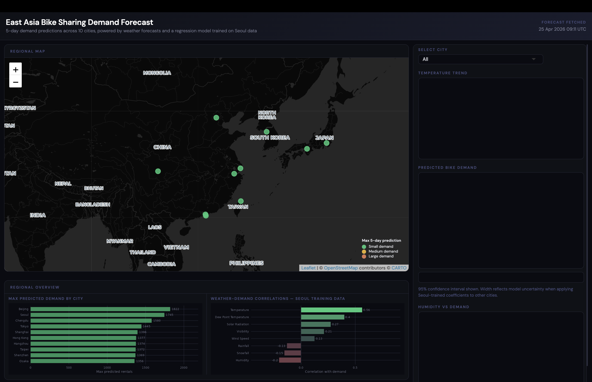
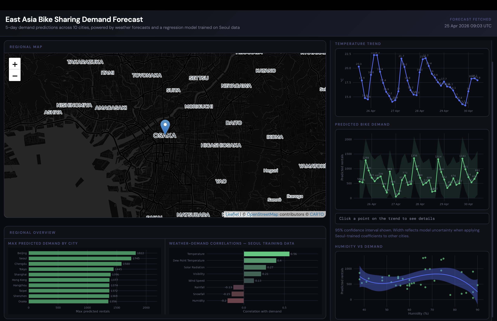

# East Asia Bike Sharing Demand Forecast

> An end-to-end data analysis project exploring global bike sharing systems and demand forecasting for Seoul, using R.
> 5-day hourly bike-sharing demand forecasts for 10 East Asian cities, powered by a regression model trained on Seoul data and delivered through a live interactive R Shiny dashboard.

**[Live Dashboard](https://gb4c45-milcah-joseph.shinyapps.io/project/)** | Built with R, tidymodels, Shiny, Leaflet, OpenWeather API

---

## Overview

This project builds an end-to-end data science pipeline in R to forecast bike-sharing demand across East Asia. A linear regression model is trained on a full year of hourly demand data from Seoul (8,465 records), then applied to live 5-day weather forecasts for 10 cities to produce forward-looking demand predictions. Results are surfaced through an interactive dashboard that updates automatically with each session.

The pipeline covers every stage of a production data science workflow: web scraping, API integration, data wrangling, exploratory analysis (SQL and ggplot2), regression modeling, and deployment.

---

## Dashboard

The deployed Shiny app fetches live weather data from the OpenWeather API on each session load and generates demand forecasts for all 10 cities.

**Regional overview** showing max predicted demand across all cities:



**City drill-down** with temperature trend, predicted demand with 95% confidence interval, and humidity vs demand scatter:



Key features:
- Leaflet map with circle markers sized and colored by demand level (green / yellow / red)
- City dropdown for street-level drill-down with weather popup
- 5-day temperature trend and predicted demand trend with 95% confidence interval ribbon
- Clickable demand trend showing datetime and predicted value on click
- Humidity vs demand scatter with polynomial smooth
- Regional bar chart of max predicted demand across all 10 cities
- Weather-demand correlation chart derived from the full Seoul training dataset
- Forecast timestamp displayed on every load

---

## Repository Structure

```
R_bike_sharing_analysis/
├── notebooks/
│   ├── 01_data_collection_webscraping_apicall.ipynb
│   ├── 02_data_wrangling_regex_dplyr.ipynb
│   ├── 03_eda_sql.ipynb
│   ├── 04_eda_ggplot2.ipynb
│   └── 05_modeling.ipynb
├── shiny/
│   ├── ui.R
│   ├── server.R
│   ├── model_prediction.R
│   ├── model.csv
│   ├── selected_cities.csv
│   └── weather_demand_correlations.csv
├── data/
│   └── raw/               # source attribution below; files not tracked
└── README.md
```

---

## Data Sources

| Dataset | Source | Description |
|---|---|---|
| Seoul Bike Sharing | IBM Skills Network CDN | 8,465 hourly demand records, Dec 2017 to Nov 2018 |
| Global Bike Sharing Systems | Wikipedia (web scraped) | Fleet sizes and city metadata |
| World Cities | IBM Skills Network CDN | Geographic coordinates for city matching |
| 5-day Weather Forecast | OpenWeather API (free tier) | Temperature, humidity, wind, rainfall, snowfall every 3 hours |

The Seoul dataset and world cities file are publicly available and not tracked in this repo. The OpenWeather API requires a free API key stored as an environment variable.

---

## Methodology

### Data Collection
Wikipedia's bicycle-sharing systems table was scraped using `rvest`. The OpenWeather free-tier forecast API was called for each city, collecting 40 forecast timestamps (every 3 hours over 5 days) per city. All raw outputs were saved as CSVs before any transformation.

### Data Wrangling
Column names were standardized to uppercase with underscore separators across all four datasets. Reference links (e.g. `[1]`, `[23]`) were removed from scraped text using regex via `str_replace_all`. Missing values in `RENTED_BIKE_COUNT` (3%) were dropped as the response variable cannot be imputed; 11 missing temperature values in Summer were imputed with the seasonal mean. Categorical variables (season, holiday, hour) were encoded as indicator columns via `pivot_wider`, and 9 numeric columns were normalized to [0, 1] using min-max scaling.

### Exploratory Data Analysis

**SQL EDA:** 11 queries were run against an RSQLite in-memory database. Key findings:
- Peak demand occurs at hour 18 in summer (2,135 average rentals), with the all-time single-hour peak of 3,556 on 19 June 2018
- Summer demand averages 1,034 rentals per hour vs 226 in winter
- Temperature and solar radiation peak in summer; snowfall is concentrated in winter

**Visual EDA:** ggplot2 charts confirmed a strong seasonal pattern in the demand time series, with consistent 8am and 6pm commute peaks year-round regardless of season. Demand vs temperature scatter (faceted by season) showed a positive non-linear relationship strongest in spring and summer. The demand distribution is right-skewed with a mode around 250 bikes.

### Modeling

Six models were built and evaluated using tidymodels with an 80/20 train-test split:

| Model | R² | RMSE |
|---|---|---|
| Weather Only (baseline) | 0.44 | high |
| All Features | 0.69 | - |
| Polynomial terms | 0.77 | - |
| Interaction terms | 0.77 | 322 |
| Ridge (glmnet) | 0.77 | - |
| Lasso / Elastic Net | 0.77 | - |

The largest single improvement came from adding polynomial terms (TEMPERATURE degree 6, HUMIDITY / DEW_POINT / RAINFALL degree 4), jumping R² from 0.69 to 0.77. Regularization via glmnet (5-fold cross-validation across 20 penalty values) did not improve on the interaction model on this dataset.

**Best model:** Interactions with polynomial terms, R² = 0.771, RMSE = 322.

Key coefficient findings:
- `RAINFALL` has the largest absolute coefficient (-59), the single biggest deterrent to demand
- `HOUR_18` has the highest positive hour coefficient (+691 on the raw scale)
- `WINTER` suppresses demand by 359 rentals on average, controlling for weather
- `WIND_SPEED` and `VISIBILITY` are near-zero once temperature and precipitation are accounted for

The raw (non-normalized) model coefficients were exported as `model.csv` for direct use in the dashboard, allowing live API weather values to feed the model without rescaling.

### Cross-City Application

The model was trained exclusively on Seoul data and applied to 10 East Asian cities: Seoul, Tokyo, Shanghai, Beijing, Hangzhou, Shenzhen, Osaka, Chengdu, Hong Kong, and Taipei. This transfer is directionally defensible given shared temperate climates, 4-season patterns, and established cycling cultures across the region, but city-specific calibration would improve precision. The dashboard displays 95% confidence intervals (±1.96 × RSE of 377.9) to communicate this uncertainty transparently.

---

## Key Results

- **R² = 0.771, RMSE = 322** on the normalized test set, meeting both project benchmarks (R² > 0.72, RMSE < 330)
- Temperature (r = 0.56) and dew point (r = 0.40) are the strongest positive correlates of demand from the Seoul training data
- Humidity (r = -0.20), snowfall (r = -0.15), and rainfall (r = -0.13) suppress demand
- Peak demand consistently occurs at hour 18 in summer across the Seoul dataset

---

## Tech Stack

| Area | Tools |
|---|---|
| Data collection | `rvest`, `httr`, OpenWeather API |
| Data wrangling | `tidyverse`, `stringr`, `lubridate` |
| EDA | `RSQLite`, `ggplot2` |
| Modeling | `tidymodels`, `glmnet` |
| Dashboard | `shiny`, `leaflet`, `ggplot2`, `scales` |
| Environment | Google Colab (R runtime), Posit Cloud, shinyapps.io |

---

## Author

Milcah Joseph


## Acknowledgements

This project was developed with assistance from [Claude](https://claude.ai) (Anthropic), 
which supported dashboard UI/CSS architecture, server-side Shiny logic, and README drafting.
All analytical decisions, modeling choices, and results interpretation are the author's own.
